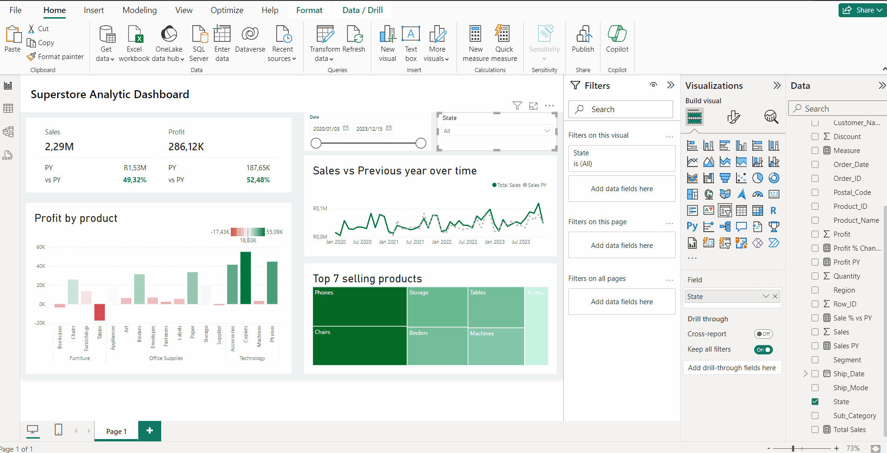
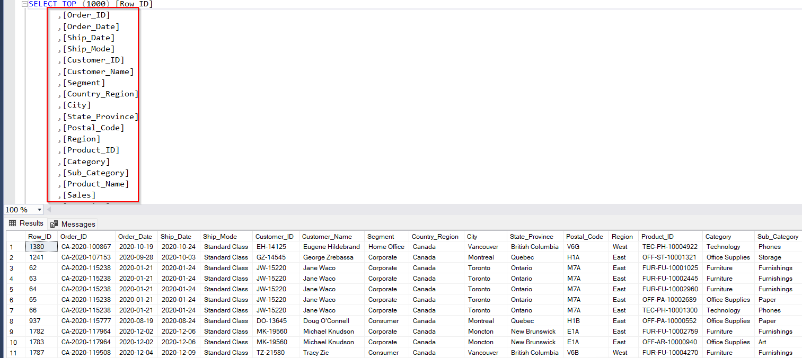
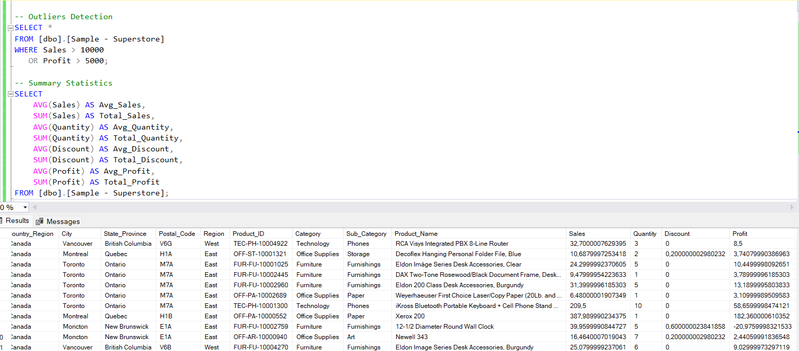
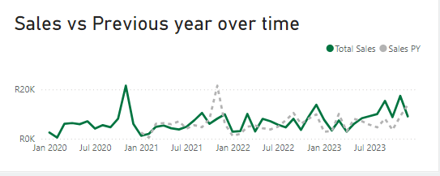

# Data Portfolio: Superstore Sales Analysis





# Table of contents

- [Objective](#objective)
- [Data Source](#data-source)
- [Stages](#stages)
- [Design](#design)
  - [Dashboard Components](#dashboard-components)
  - [Mockup](#mockup)
  - [Tools](#tools)
- [Development](#development)
  - [Pseudocode](#pseudocode)
  - [Data Exploration](#data-exploration)
  - [Data Cleaning](#data-cleaning)
  - [Transform the Data](#transform-the-data)
  - [Create the SQL View](#create-the-sql-view)
- [Testing](#testing)
  - [Data Quality Tests](#data-quality-tests)
- [Visualization](#visualization)
  - [Results](#results)
  - [DAX Measures](#dax-measures)
- [Analysis](#analysis)
  - [Findings](#findings)
  - [Validation](#validation)
  - [Discovery](#discovery)
- [Recommendations](#recommendations)
  - [Potential ROI](#potential-roi)
  - [Potential Courses of Actions](#potential-courses-of-actions)
- [Conclusion](#conclusion)

# Objective

- **Key Pain Point:**
  The sales team needs detailed insights into the performance of different product categories, segments, and regions to optimize sales strategies and improve profitability.

- **Ideal Solution:**
  Create an interactive dashboard that provides comprehensive insights into sales performance, including:
  - Sales revenue
  - Profit margins
  - Customer segments
  - Regional performance

This will help the sales team make data-driven decisions to enhance sales strategies and profitability.

## User Story

As a Sales Manager, I want to use a dashboard that provides detailed insights into sales performance across various product categories, segments, and regions. This will help me identify trends and opportunities to optimize sales strategies and improve overall profitability.

# Data Source



- **What data is needed to achieve our objective?**
  - Sales data
  - Product data
  - Customer data
  - Regional data

- **Where is the data coming from?**
  - The data is sourced from the Superstore dataset, which includes information on sales, products, customers, and regions.

# Stages

- Design
- Development
- Testing
- Analysis

# Design

## Dashboard Components

To understand what the dashboard should contain, we need to determine the key questions it should answer:

1. What are the total sales and profit for each product category?
2. Which regions are generating the highest sales and profit?
3. What are the sales and profit trends over time?
4. How do different customer segments contribute to sales and profit?

## Dashboard Mockup

- **What should it look like?**

The following visuals may be appropriate to answer our questions:
1. Bar Chart: Total sales and profit by product category
2. Map: Sales and profit by region
3. Line Chart: Sales and profit trends over time
4. Pie Chart: Sales and profit by customer segment


## Tools

| Tool       | Purpose                                   |
|------------|-------------------------------------------|
| Excel      | Exploring the data                        |
| SQL Server | Cleaning, testing, and analyzing the data |
| Power BI   | Visualizing the data via interactive dashboards |
| GitHub     | Hosting the project documentation and version control |
| Mockup AI  | Designing the wireframe/mockup of the dashboard |

# Development

## Pseudocode

1. Load the data
2. Explore the data in Excel
3. Load the data into SQL Server
4. Clean the data with SQL
5. Test the data with SQL
6. Visualize the data in Power BI
7. Generate insights based on the analysis
8. Write the documentation and commentary
9. Publish the data to GitHub Pages

## Data Exploration Notes

Initial observations about the dataset:

1. The dataset includes multiple columns related to sales, products, customers, and regions.
2. Some columns may contain null values or inconsistent data that need to be cleaned.
3. We have more data than needed, so unnecessary columns should be removed.

## Data Cleaning

### Expected Clean Data

- Only relevant columns should be retained.
- All data types should be appropriate for the contents of each column.
- No column should contain null values, ensuring complete data for all records.

| Property        | Description |
|-----------------|-------------|
| Number of Rows  | Varies      |
| Number of Columns | 4         |

### Expected Schema

| Column Name       | Data Type | Nullable |
|-------------------|-----------|----------|
| Order_ID          | VARCHAR   | NO       |
| Product_Category  | VARCHAR   | NO       |
| Sales             | FLOAT     | NO       |
| Profit            | FLOAT     | NO       |

### Cleaning Steps



1. Remove unnecessary columns.
2. Rename columns using aliases.
3. Ensure all columns have appropriate data types.
4. Remove rows with null values.

```sql
/*
# 1. Select the required columns
# 2. Rename columns using aliases
*/

SELECT
    Order_ID AS order_id,
    Product_Category AS product_category,
    Sales AS sales,
    Profit AS profit
FROM
    superstore_sales


## DAX Measures

To calculate important metrics in Power BI, we can create the following DAX measures:

```
Metrics - Sales, Profit, Show % change vs PY:

Sales = SUM('Sample - Superstore'[Sales])
Profit = SUM('Sample - Superstore'[Profit])

Sales % Change vs PY =
VAR CurrentYearSales = [Sales]
VAR PreviousYearSales = CALCULATE([Sales], SAMEPERIODLASTYEAR('Date'[Order Date]))
RETURN
IF(ISBLANK(PreviousYearSales), BLANK(), (CurrentYearSales - PreviousYearSales) / PreviousYearSales)

Compare Sales performance versus previous year over time: 

Sales by Month = SUM('Sample - Superstore'[Sales])

Sales Previous Year = CALCULATE([Sales], SAMEPERIODLASTYEAR('Date'[Order Date]))

```

These measures can be used in various visuals and calculations within the Power BI dashboard.

# Analysis

## Findings

After visualizing the data in Power BI, we can derive the following key findings:

1. **Top-Performing Product Categories:**
   - The "Technology" and "Office Supplies" categories generate the highest sales and profit.
   - The "Furniture" category has a relatively low profit margin compared to other categories.

2. **Regional Performance:**
   - The West and South regions contribute the most to overall sales and profit.
   - The East region has the lowest sales and profit among all regions.

3. **Trends Over Time:**
   - Sales and profit have been steadily increasing over the past few years.
   - There is a noticeable spike in sales  during the fourth quarter (Q4) of each year.



4. **Customer Segments:**
   - The "Consumer" segment accounts for the largest portion of sales and profit.
   - The "Corporate" segment generates higher profit margins than the "Home Office" segment.

## Validation

To validate our findings, we can:

1. Cross-check the numbers and calculations with the source data.
2. Consult with domain experts (e.g., sales managers, product managers) to confirm the accuracy and reasonableness of the insights.
3. Compare the insights with industry benchmarks or historical data, if available.


# Recommendations

## Potential ROI

Based on the insights derived from the analysis, implementing the following recommendations could potentially lead to increased sales and profitability:

1. Focus marketing efforts on promoting high-performing product categories like "Technology" and "Office Supplies."
2. Invest in improving sales strategies and operations in underperforming regions like the East.
3. Leverage the Q4 sales trends by running targeted promotions and campaigns during that period.
4. Explore opportunities to improve profit margins in the "Furniture" category.

## Potential Courses of Actions

1. **Optimize Product Mix:**
   - Allocate more resources and marketing efforts towards promoting the top-performing product categories.
   - Conduct market research to identify potential improvements or new product offerings for the "Furniture" category.

2. **Enhance Regional Strategies:**
   - Analyze the factors contributing to the underperformance of the East region (e.g., competition, market saturation, customer preferences).
   - Develop targeted strategies to improve sales and operations in the underperforming regions.

3. **Seasonal Promotions and Campaigns:**
   - Capitalize on the Q4 sales trends by launching seasonal promotions, discounts, and marketing campaigns during that period.
   - Analyze the factors behind the Q4 sales spikes (e.g., holiday season, consumer behavior) and leverage those insights for future campaigns.

4. **Segment-Specific Strategies:**
   - Tailor marketing and sales strategies to cater to the preferences and needs of different customer segments.
   - Explore opportunities to improve profit margins for the "Corporate" and "Home Office" segments.

# Conclusion

The Superstore Sales Analysis dashboard provides valuable insights into sales performance, product categories, regional performance, and customer segments. By leveraging these insights, the sales team can make data-driven decisions to optimize their strategies, enhance profitability, and drive business growth.

The key recommendations include focusing on top-performing product categories, addressing underperforming regions, capitalizing on seasonal trends, and tailoring strategies for different customer segments. Implementing these recommendations can potentially lead to increased sales, improved profit margins, and a competitive advantage in the market.

It is crucial to continuously monitor and analyze the data, validate findings, and adapt strategies as needed to stay ahead of market trends and customer demands. Regular updates to the dashboard and ongoing data analysis will ensure that the sales team has access to the most relevant and actionable insights for informed decision-making.
